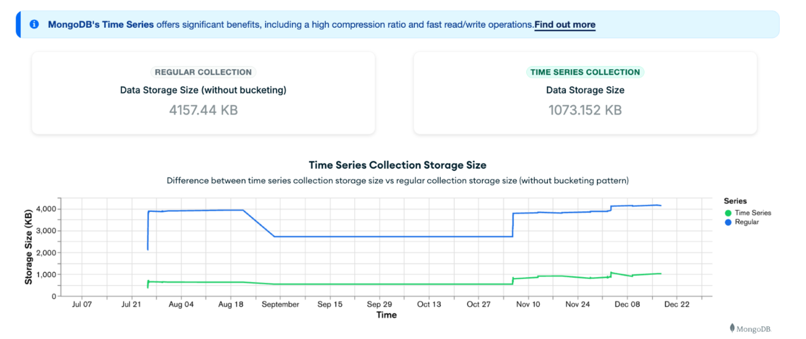

# Leafy Smart Meters

   

This demo will showcase how to integrate [MongoDB](https://www.mongodb.com/) with MQTT providers like [Cedalo](https://cedalo.com/) and perform real-time statistical anomaly detection analysis using [change streams](https://www.mongodb.com/resources/products/capabilities/change-streams) while highlighting the benefits of using [Time Series Collections](https://www.mongodb.com/products/capabilities/time-series) for this type of workloads.


If you want to learn more about Smart Meter Systems and IoT use cases in MongoDB, visit the following pages:

- [Saving Energy, Smarter: MongoDB and Cedalo for Smart Meter Systems](https://www.mongodb.com/blog/post/saving-energy-smarter-mongodb-cedalo-for-smart-meter-systems)
- [MongoDB for Internet of Things (IoT)](https://www.mongodb.com/solutions/use-cases/internet-of-things)
- [MongoDB Solutions Library](https://www.mongodb.com/solutions/solutions-library)

Let's get started!

## Prerequisites

- **MongoDB Atlas** (M0 or higher): This project uses a MongoDB Atlas cluster to store and analyze smart meters IoT data. You should have a MongoDB Atlas account and a minimum free tier cluster set up. If you don't have an account, you can sign up for free at [MongoDB Atlas](https://www.mongodb.com/cloud/atlas/register). Once you have an account, follow the [Getting Started](https://www.mongodb.com/docs/atlas/getting-started/) guide to set up a minimum free tier cluster.

- **Mosquitto MQTT Broker** (Pro Edition): The partner of choice for this demo to set up an MQTT broker is Cedalo. This demo guide includes a fast setup that will deploy the MQTT broker for you, you just need to obtain a license `.lic` file. You can obtain a free trial license of the Pro Edition [here](https://cedalo.com/mqtt-broker-pro-mosquitto/). Alternatively, if you decide to host your own MQTT broker separately from the rest of the demo, you can follow Cedalo's official documentation for an [on prem set up](https://docs.cedalo.com/mosquitto/getting-started/onprem/).

- **Docker environment**: To run Cedalo's Docker products, you need an installed version of Docker and Docker Compose. Additionally, Docker can also be leveraged to run the demo application itself. Open the Docker installation page and install [Docker Desktop](https://www.docker.com/products/docker-desktop/). Alternativelly, you can install [Docker Engine](https://docs.docker.com/engine/install/) and [Docker Compose](https://docs.docker.com/compose/install/) separately.

- **npm** (version 10.0 or higher): The smart meter demo app relies on npm (Node Package Manager) to manage dependencies and run scripts. You need to have npm installed on your machine. You can download Node.js from the official website: [Node.js Downloads](https://nodejs.org/en/download). After installing Node.js, npm will be available by default.

- **mongorestore** (version 100.9.4 or higher): The [mongorestore](https://www.mongodb.com/docs/database-tools/mongorestore/) tool loads data from a binary database dump. The [dump](dump) directory includes a demo database with preloaded collections to get you up and running in no time. This tool is part of the [MongoDB Database Tools](https://www.mongodb.com/docs/database-tools/) package, follow the [Database Tools Installation Guide](https://www.mongodb.com/docs/database-tools/installation/installation/) to install `mongorestore`. When you are done with the installation, run `mongorestore --version` in your terminal to verify the tool is ready to use.

## MongoDB Atlas Configuration

### Replicate the Demo Database

To replicate the demo database on your MongoDB Atlas cluster, from the cloned repository root folder run the following command in your terminal:

```bash
mongorestore --uri <your-connection-string> utils/dump/
```

Make sure to replace `<your-connection-string>` with your MongoDB Atlas connection string.

> [!Note]
> You will need the database name to set up your environment variables later (`DB_NAME`).
> If the database name has not been specified, the default name will be `smart_meters`.

### Set up Atlas Charts

To visualize one of the advantages of using MongoDB time series collections for IoT data, we will compare the data storage size of regular and time series collections in a line chart. Follow the steps bellow to replicate this chart:

1. Navigate to the "Charts" section located next to "Data Services". Click the down arrow next to "Add Dashboard", then click "Import Dashboard".

2. Select the `Smart Meters.charts` file from the [charts folder](./utils/charts) and click "Next".

3. Click on the pencil icon and ensure the database is correctly assigned to the one previously created. Click "Save", and then "Save" again.

4. Then, click on the three dots in the top right corner of the newly created dashboard, and select "Embed". Check the "Enable unauthenticated access" option. Choose the embedding method through the "Iframe", and copy the "src" value. Click close.

> [!Note]
> You will need the base URL and dashboard IDs to set up your environment variables later (`NEXT_PUBLIC_APP_IFRAME_SRC`).

For a more detailed guide on how to import and embed Atlas Charts in your application, visit the official documentation:

- [Import and Export a Dashboard](https://www.mongodb.com/docs/charts/dashboards/dashboard-import-export)
- [Embed Charts with an iframe](https://www.mongodb.com/docs/charts/embedding-charts-iframe/)

## Set up Cedalo's MongoDB Bridge

To integrate Cedalo's Mosquitto Pro MQTT broker with MongoDB, you need to enable and configure the MongoDB Bridge plugin. This plugin allows seamless interaction between MQTT messages and MongoDB collections, enabling real-time analysis and processing of IoT data.

The Mosquitto configuration file provided in this repository ([mosquitto/config/mosquitto.conf](mosquitto/config/mosquitto.conf)) already includes the MongoDB Bridge plugin enabled. For a quick demo setup, no changes to this file are necessary.

> [!Warning]
> If you plan to host the Mosquitto Pro MQTT broker on a separate server, note that the configuration provided is not intended for production environments; you will need to enable additional security features.

Then you will need to configure the MongoDB Bridge plugin. Start by copying the provided template configuration file to the appropriate location. Run the following command in your terminal from the project root:

```bash
cp mosquitto/data/template-mongodb-bridge.json mosquitto/data/mongodb-bridge.json
```

Next, open the newly created `mosquitto/data/mongodb-bridge.json` file in your favorite text editor. Locate the `mongodb.connectionURI` field and update it with your MongoDB Atlas connection string. Ensure your connection string includes the appropriate credentials and points to your Atlas cluster.

For a quick demo setup, you can leave the updated `mongodb-bridge.json` file in its current location. If you plan to host the Mosquitto Pro MQTT broker on a separate server for a production environment, you can copy this configuration file to your broker's deployment directory.

For additional guidance on hosting the broker on a separate server, refer to the [mosquitto/README.md](mosquitto/README.md) file included in this repository. This file contains helpful resources and links to Cedalo’s official documentation.

## Run the application

### Update your environment variables

To run this project, you will need some environment variables. Copy the `EXAMPLE.env` file in the [smart-meter-frontend](smart-meter-frontend/EXAMPLE.env) directory to `.env.local` (which will be ignored by Git) as seen below:

```bash
cp smart-meter-frontend/EXAMPLE.env smart-meter-frontend/.env.local
```

Now open this file in your preferred text editor or IDE and update each variable on `.env.local`.

If you plan to follow the demo quick setup, the MQTT broker will be hosted next to the demo application, so you can leave the `MQTT_BROKER` variable as `mqtt://localhost:1883`. The basic demo config file allows anonymous connections to the broker, so you can input any dummy username and password for the `MQTT_USERNAME` and `MQTT_PASSWORD` variables for now. Additionally, if you have restored the database from the dump file, no changes in the database name or collection names are needed.

The two variables that are mandatory to replace with your own values are `MONGODB_URI` and `NEXT_PUBLIC_APP_IFRAME_SRC`. Refer to the sections [Replicate the Demo Database](#replicate-the-demo-database) and [Set up Atlas Charts](#set-up-atlas-charts) for detailed instructions on how to obtain these values.

### Start the System Components

To start the system, you can choose one of two options based on your setup and preferences. Each option provides a different level of integration and flexibility. Please review the steps for both options and select the one that best suits your needs.

#### Option A: All-in-One - No Hosted MQTT Broker Required

This option runs all components, including the MQTT broker and the demo application, using Docker. It's ideal for a quick and easy setup without needing to host the MQTT broker separately.

Steps:

1. **Obtain License Files**:

   - Acquire the necessary `.lic` files for the Mosquitto MQTT broker and the management center.
   - Place the files in the following locations:
     - `mosquitto/license/` for the MQTT broker.
     - `management-center/config/` for the management center.

2. **Optional Configuration**:

   - If needed, update the Mosquitto configuration file to add additional plugins or modify default parameters for enhanced security or functionality.

3. **Start the System**:

   - From the root folder of the repository, run the following command:

     ```bash
     docker compose up
     ```

   - This will deploy all components, including the MQTT broker, management center, and demo application. Once completed, the system will be fully operational, and you can start using the app.

#### Option B: Demo Application Only - Requires a Hosted MQTT Broker

If you’ve chosen to host the MQTT broker separately, this option allows you to run just the demo application.

Steps:

1. **Ensure MQTT Broker is Running**:

   - Verify that your hosted MQTT broker is active and accessible.

2. **Install Dependencies**:

   - Navigate to the demo application folder:

     ```bash
     cd smart-meter-frontend
     ```

   - Install the required dependencies using:

     ```bash
     npm ci
     ```

3. **Run the Application**:

   - Start the demo app in development mode with the following command:

     ```bash
     npm run dev
     ```

   - Once the application starts, you can access it through your browser and begin exploring its features.

### Use the application

Use a browser to open the link http://localhost:3000/

Click on "Start Simulation" to start the demo. You will see raw data as well as anomaly data coming in. At the bottom of the page, you will find some metrics around compression in Time Series Collection. Important to note here is that performance metrics depend on many factors including how they are calculated in the application. This example is showing just one simple method of calculating these metrics.



> [!Note]
> The default probablity of anomaly coming in is only 20%. So there will be cases where you dont see anomalies. If you want to increase the probability, just increase the value `0.20` in `Leafy-Smart-Meters/smart-meter-frontend/utils/simulation.js` line 82.
